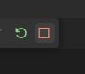

# 02_hello_html_typescript

:memo: [éditer cette page](https://gitlab.com/-/ide/project/webdev101/02_hello_html_typescript/edit/main/-/README.md)

## cloner le dépôt

dans VSCode, clonez le dépôt <https://gitlab.com/webdev101/02_hello_html_typescript.git>

## lire et comprendre

vous devez lire et comprendre le code source de `index.html` que voici

[index.html](index.html ":include :type=code html")

vous devez ensuite lire et comprendre le code source de `app.ts` que voici

[app.ts](app.ts ":include :type=code typescript")

## transpiler

transpilez dans un terminal avec

```terminal
tsc app.ts
```

le fichier `app.js` est créé, il sera exécuté dans le navigateur lors de l'ouverture de `index.html`

en effet, le script transpilé `app.js` est lié au fichier `index.html` grâce à cette balise

```html
<script src="app.js"></script>
```

## exécuter dans un navigateur

Vous devez d'abord démarrer un serveur local, pour cela utilisez l'extension Live Server dans VSCode.
Installez cette extension si elle n'est pas déjà installée, puis allez dans la configuration de l'extension (clic droit sur l'icône de l'extension dans la barre latérale > Extension Settings) et cochez Live Server › Settings: No Browser (If it is true live server will start without browser opened). Cela permettra de démarrer le serveur sans ouvrir le navigateur par défaut, car nous allons plutôt utiliser Chrome en mode débogage.

Cliquez ensuite sur "Go Live" en bas à droite de la fenêtre VSCode. Vous verrez ensuite un message dans la barre de statut en bas à gauche de la fenêtre qui indique "Port : 5500".

Ajoutez une configuration de débogage pour Chrome dans le fichier `.vscode/launch.json` (créez-le s'il n'existe pas) - vous pouvez aussi le faire en allant dans Execution > Ajouter une configuration de débogage... > Chrome (lancer) et en modifiant le fichier qui s'ouvre. En particulier, changez le port de 8080 à 5500 (car c'est celui utilisé par défaut par Live Server) - aussi le name peut être changé pour "Chrome localhost:5500" pour plus de clarté. Le fichier devrait ressembler à ceci

```json
{
    "version": "0.2.0",
    "configurations": [
        {
            "name": "Chrome localhost:5500",
            "type": "chrome",
            "request": "launch",
            "url": "http://localhost:5500",
            "webRoot": "${workspaceFolder}",
        }
    ]
}
```

S'il y a déjà des configurations, ajoutez simplement celle-ci à la liste en ajoutant une virgule après la dernière accolade fermante du tableau configurations.

Ensuite dans le menu à gauche, cliquez sur l'icône de débogage (ou appuyez sur F5). Choisissez la configuration créée dans la liste déroulante ("Chrome localhost:5500" si vous avez changé son nom), puis cliquez sur la flèche verte ou appuyez sur F5 pour démarrer l'exécution, le navigateur est lancé: vous verrez `Hello World!`

Vous pouvez ouvrir les devtools en appuyant sur F12 ou clic droit sur la page > Inspecter, puis en cliquant sur l'onglet Console vous verrez les messages de débogage.

Si vous avez le message `GET http://localhost:5500/app.js net::ERR_ABORTED 404 (Not Found) ` dans la console, c'est sûrement que vous avez oublié de transpiler le fichier `app.ts` en `app.js` avec la commande `tsc app.ts` dans un terminal, ou que le fichier app.js n'est pas au bon endroit.

cliquer sur le carré rouge pour arrêter (et fermer chrome), ou la flèche ronde verte pour redémarrer le programme du début



# Exercice

- créer une application web en TypeScript qui affiche "Bonjour, TypeScript!" dans la page web:
  - créer programmatiquement (depuis l'application TypeScript) un div avec un id "app"
  - créer un h1 avec le texte "Bonjour, TypeScript!"
  - ajouter le h1 dans le div
  - ajouter le div dans le body
- Démarrez un serveur avec Live Server et déboguez dans Chrome votre application.